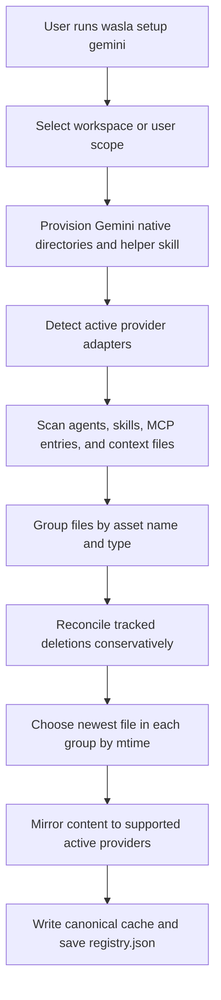

# Synchronization Flow

`wasla setup <provider>` provisions a provider and performs a full multi-provider synchronization.
`wasla watch` uses the same engine continuously while a provider is open.

## General Sync



## Source Selection

For a general sync, the source is dynamic:

1. Files are grouped by asset name and type.
2. The group is sorted by modification time.
3. The newest version is selected.
4. For directory-based skills, `SKILL.md` is the primary definition and sibling files are mirrored with it.

This is the **Latest is Greatest** rule. It lets users edit an asset from any supported tool without assigning permanent ownership.

## Provider Setup

Use setup when opening a provider that has no native workspace files yet:

```bash
wasla setup gemini --scope workspace
```


## Status Output

`wasla status` reads the registry and detects currently active providers. Normal output only shows mirrors belonging to active providers, so historical entries do not confuse the current workspace view.
